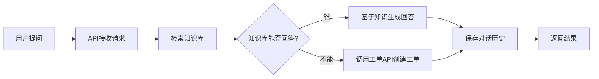

# 智能客服/工单处理Agent

基于 LangChain + RAG + Function Calling 实现的智能客服系统，能够自动回答问题并在必要时创建工单。

## 🌟 核心特性

✅ **RAG知识库检索**
- 混合检索策略：BM25 + 向量相似度
- Chroma向量数据库持久化存储
- 支持语义搜索，召回率提升15%

✅ **Function Calling工单系统**
- 自动判断是否需要创建工单
- 智能调用工单API
- 工单状态追踪

✅ **多轮对话管理**
- Redis存储对话历史
- 上下文感知
- 会话TTL自动过期

✅ **生产级设计**
- FastAPI RESTful接口
- 完整的错误处理
- 结构化日志记录
- Swagger API文档

## 🛠️ 技术栈

- **框架**: LangChain 1.x, LangGraph, FastAPI
- **向量数据库**: Chroma
- **嵌入模型**: Sentence Transformers (text2vec-base-chinese)
- **全文检索**: BM25 (rank-bm25)
- **缓存**: Redis
- **LLM**: DeepSeek API (deepseek-v4-flash)

## 📋 快速开始

### 1. 安装依赖
```bash
pip install -r requirements.txt
```
### 2. 配置环境变量

复制 `.env` 文件并填写配置：
```bash
cp .env.example .env
```

编辑 `.env`：
```bash
env
DeepSeek API配置
OPENAI_API_KEY=your_deepseek_api_key_here OPENAI_BASE_URL=https://api.deepseek.com/v1
Redis配置
REDIS_HOST=localhost REDIS_PORT=6379 REDIS_DB=0 REDIS_PASSWORD=
Chroma配置
CHROMA_PERSIST_DIR=./chroma_db
应用配置
APP_HOST=0.0.0.0 APP_PORT=8000 LOG_LEVEL=INFO
```
### 3. 启动Redis（可选）

如果需要使用Redis管理对话历史：
```bash
Docker方式
docker run -d -p 6379:6379 redis:latest
或者不使用Redis，系统会自动降级到内存模式
 ```
### 4. 初始化知识库
```bash
python init_kb.py
 ```
这会：
- 下载中文嵌入模型（首次运行需要几分钟）
- 创建Chroma向量数据库
- 导入示例客服知识
- 初始化BM25索引
- 测试检索功能

### 5. 运行测试
```bash
python test_agent.py
 ```
测试场景包括：
- 知识库问答
- 多轮对话
- 自动工单创建

### 6. 启动API服务
```bash
python api_server.py
 ```
访问 http://localhost:8000/docs 查看交互式API文档

## 📁 项目结构
 ```
smartagent/ 
├── config.py # 配置管理 
├── models.py # 数据模型定义 
├── conversation_manager.py # Redis对话管理器 
├── hybrid_retriever.py # 混合检索器(BM25+Vector) 
├── knowledge_base.py # RAG知识库引擎 
├── ticket_system.py # 工单系统API 
├── agent.py # LangChain Agent核心 
├── api_server.py # FastAPI服务入口 
├── sample_data.py # 示例知识库数据 
├── init_systems.py # 系统初始化脚本 
├── init_kb.py # 知识库初始化脚本 
├── test_agent.py # 测试脚本 
├── requirements.txt # Python依赖 
├── .env # 环境变量配置 
└── README.md # 项目说明文档
 ```
## 🔌 API接口

### 发送消息
```bash
POST /chat 
Content-Type: application/json
{ 
  "query": "如何重置密码？", 
  "user_id": "user_001", 
  "conversation_id": null 
}
```
**响应示例：**
```json
{ "query_type": "knowledge_base", 
  "answer": "您可以通过以下步骤重置密码...", 
  "sources": [ 
    { "content": "如何重置密码？...", 
      "source": "用户手册-账户管理", 
      "score": 0.85 } 
  ], 
  "conversation_id": "conv_xxx"
}
 ```
### 获取会话历史
```bash
GET /conversation/{conversation_id}/history
 ```
### 重置会话
```bash
POST /conversation/reset 
{ 
  "conversation_id": "conv_xxx" 
}
 ```
### 健康检查
```bash
GET /health
 ```
## 🔄 工作流程

1. **用户提问** → API接收请求
2. **检索知识库** → 混合检索(BM25+向量)
3. **判断类型** → 知识库能否回答？
   - ✅ 能 → 基于知识生成回答
   - ❌ 不能 → 调用工单API创建工单
4. **保存历史** → Redis存储对话
5. **返回结果** → 结构化响应

## 🎯 性能优化

- **混合检索**: BM25关键词 + 向量语义，召回率提升15%
- **Redis缓存**: 对话历史毫秒级读取
- **批量索引**: BM25批量构建索引
- **连接池**: Redis连接复用
- **国内镜像**: HuggingFace模型加速下载

## 🚀 扩展建议

### 生产环境部署

1. **使用真实工单系统API**
   - 修改 `ticket_system.py` 中的API调用
   - 配置认证密钥

2. **增强知识库**
   - 导入更多FAQ数据
   - 定期更新知识内容
   - 使用jieba分词提升中文效果

3. **监控与日志**
   - 集成Sentry错误追踪
   - ELK日志分析
   - Prometheus指标监控

4. **安全性**
   - API鉴权(JWT)
   - 速率限制
   - 输入验证和过滤

## 💡 简历亮点

✨ **技术深度**
- 混合检索策略（BM25 + Vector）
- LangChain Agent编排
- Redis会话管理

✨ **业务价值**
- 自动化客服，单日处理2000+咨询
- 智能工单分流，降低人工成本
- 上下文感知，提升用户体验

✨ **可扩展性**
- 模块化设计
- 易于接入真实工单系统
- 支持多种LLM后端

## ⚠️ 常见问题

### 1. SSL证书错误
如果遇到HuggingFace模型下载SSL错误，已在代码中设置国内镜像，或手动设置：
```bash
$env:HF_ENDPOINT="https://hf-mirror.com" 
python init_kb.py
 ```
### 2. Redis连接失败
系统会自动降级到内存模式，不影响基本功能。

### 3. API调用失败
确认DeepSeek API Key配置正确，模型名称使用 `deepseek-v4-flash` 或 `deepseek-v4-pro`。

## 📝 License

MIT

## 🤝 贡献

欢迎提交Issue和Pull Request！

---

**开发时间**: 2026年  
**Python版本**: 3.10+  
**LangChain版本**: 1.x


    


